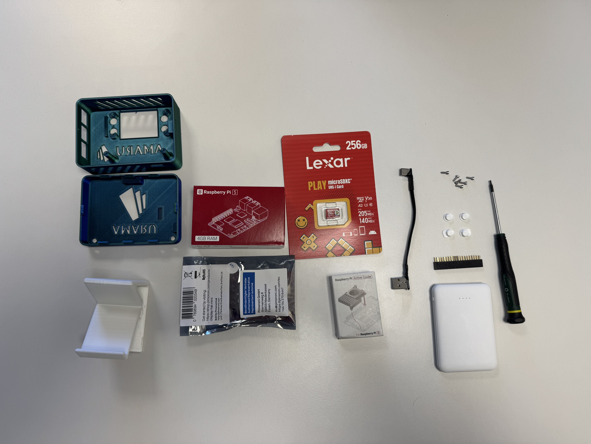
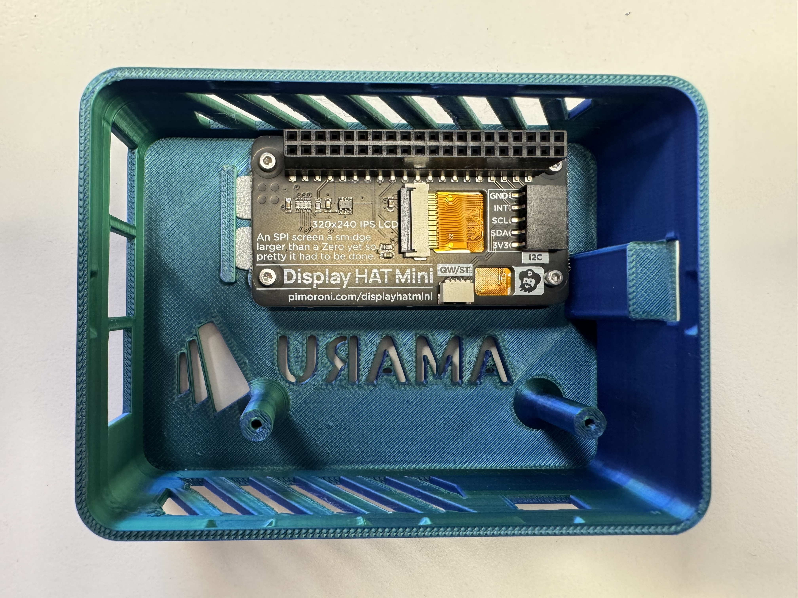
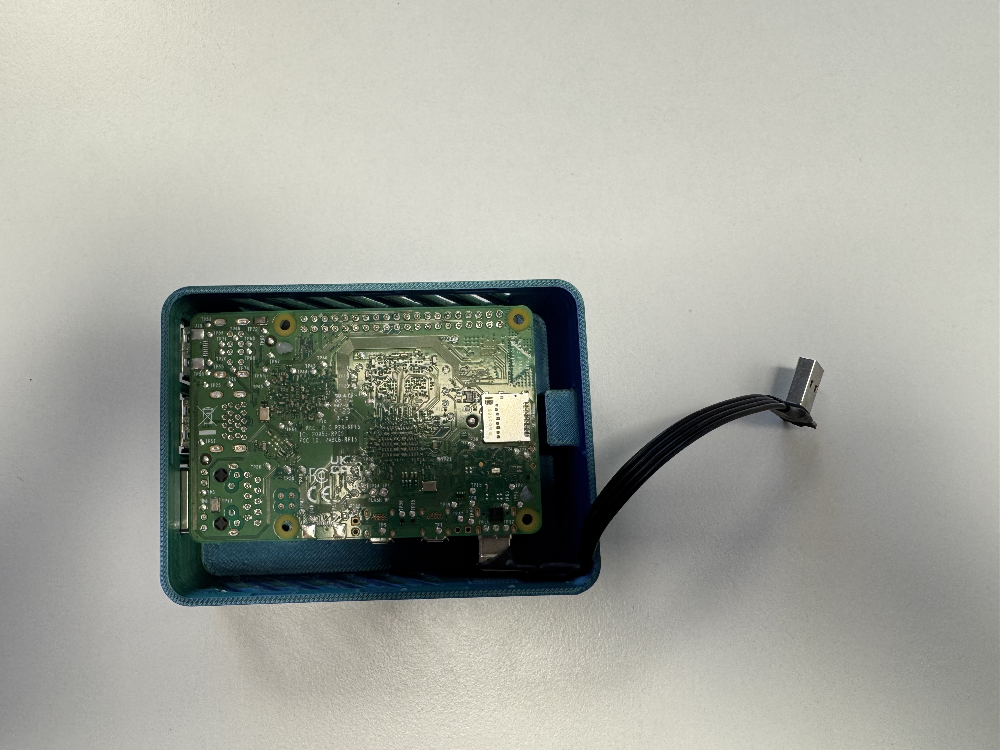
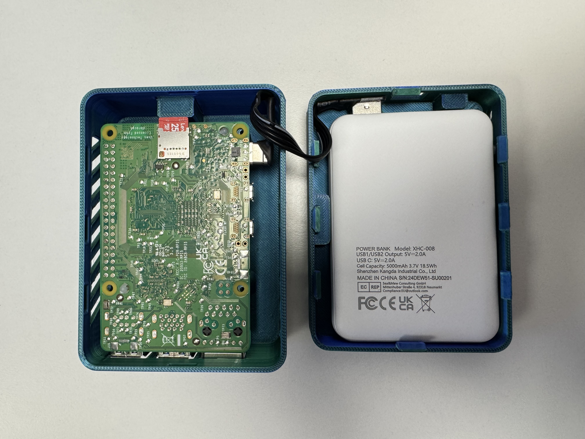
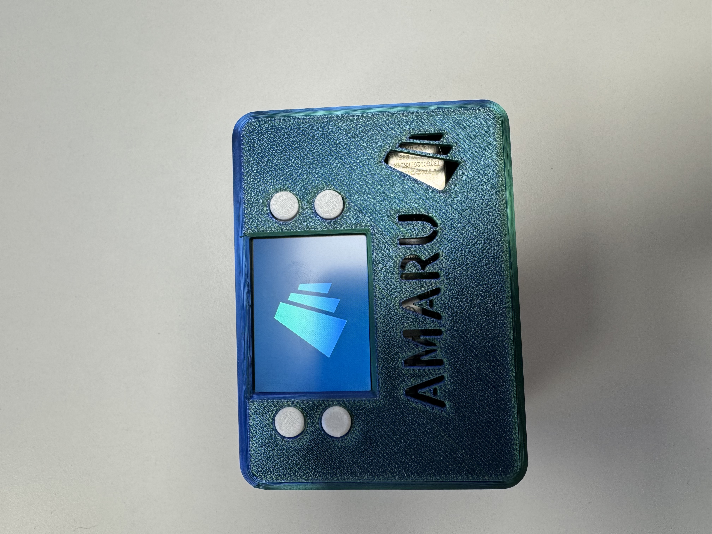

Amaru PI is fully Open Source and can be recreated entirely using simple on the shelf components and a 3d printer.

1. get the necessary [material](#bill-of-material)
2. print the [enclosure](#enclosure)
3. [assemble](#assembly) the pi
4. [flash](#flash) the SD card
5. [configure](#configure) the PI

# Bill of material

* 1 [rapsberry pi 5](https://www.raspberrypi.com/products/raspberry-pi-5/) (2G of RAM will do)
* 1 [raspberry pi active cooler](https://www.raspberrypi.com/products/active-cooler/)
* 1 [display hat mini](https://shop.pimoroni.com/products/display-hat-mini?variant=39496084717651)
* 1 fast SD card, at least 64GB
* 1 [powerbank](https://www.amazon.fr/dp/B082PPR281?th=1)
* 1 [usb cable](https://fr.aliexpress.com/item/1005001952745125.html?), 10 CM, model AMRI
* 6 M2 screws, 4mm length

# Enclosure

Necessary [STL files]() are available for 3D printing. Print one of each and an extra button.

# Assembly

Make sure you have all the material before assembling the PI.

Start with the top enclosure. 

The first step is to screw the screen. Make sure buttons are in-place before doing so.

Then stick the cooler on the PI. Do not forget to plug the power cable.

You can now fit the PI in the enclosure by making sure it plugs into the GPIO connector. Make sure everything is aligned.
This is where the GPIO expander has to be used.

No holes should be left out and everything should fit.

Now plug the USB cable in the right place.

Finally put the powerbank in the bottom part of the enclosure and close everything.

You are ready to enjoy amaru!

# Flash

Images are made available that can be directly flashed with [Raspberry PI imager](https://www.raspberrypi.com/software/).

It is also possible to create a custom image. Follow the procedure [here](https://github.com/jeluard/amaru-pi?tab=readme-ov-file#create-the-sd-image).

# Configuration

Lastly a running PI can be configured by either:

* executing the `./scripts/configure.sh` script
* using the PI itself through the settings screen
