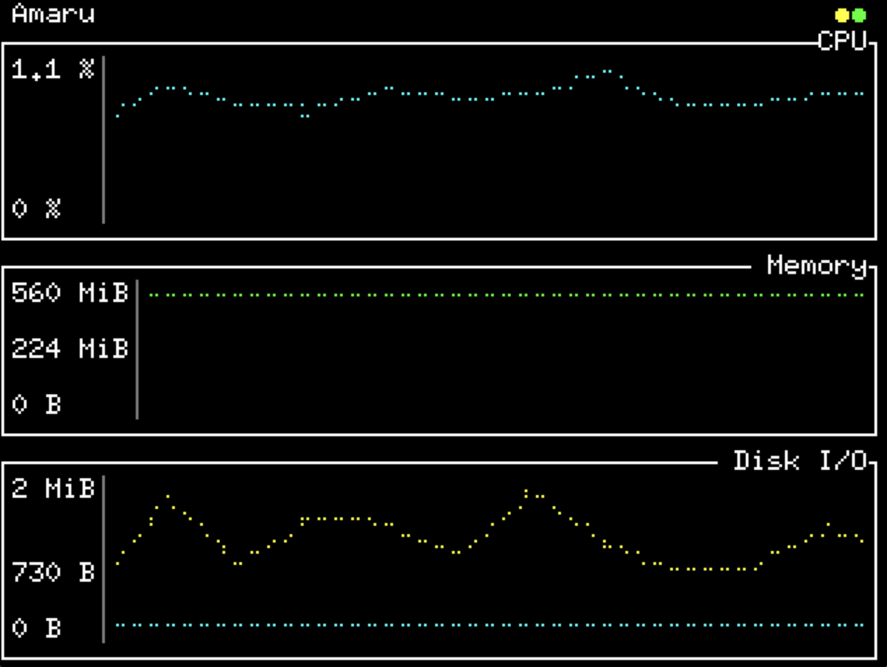
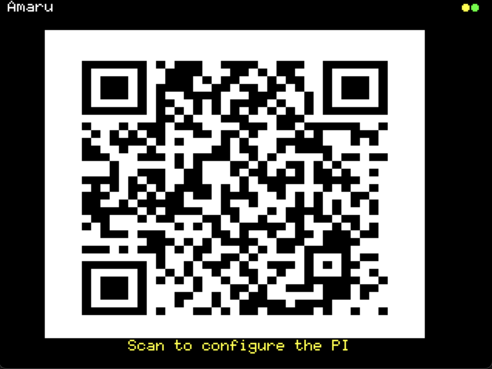
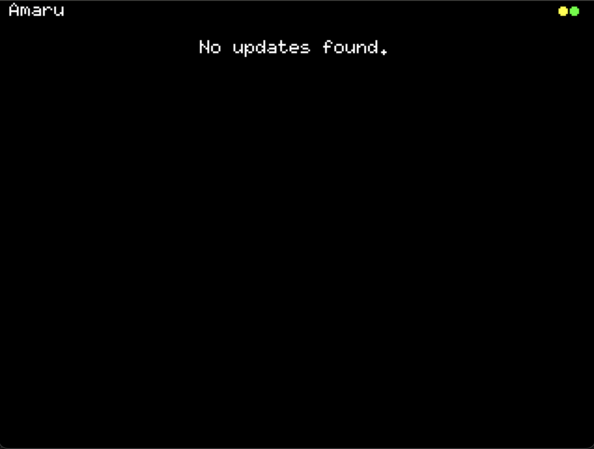

Amaru PI ships with a small LCD screen providing high-level information to the running amaru node. A number of screens 
Those screens are mostly read-only and reflect the idea that this node should run as-is without human intervention.

Screens can be navigated by pressing `B` and `Y` buttons to move respectively to screens left and right.

# Startup
    
To start the PI, hit the powerbank button once. To sopt it, hit it twice. You might need a pen to hit the button.
PI startup takes roughly 10s before the amaru logo shows up. `amaru` itself is started in background. It should automatically sync with the mainnet chain provided some internet connectivity (see [how to configure](#network)).

# Screens

Once the amaru logo vanished user ends up on the main interface composed of a number of screens.
The top also allows to quickly get an understanding of the state of the system: the right circle shows the state of newtork connectivity while the left one the state of the amaru process.

## Tip

The first screen gives a glimpse of the amaru node by showing current tip.

## Metrics

The metrics screen shows some charts of a number of metrics from the `amaru` process:

* CPU usage in percentage
* memory usage in MB
* disk I/O (read and write) in MB

## Logs

This screen allows to browse logs above the `INFO` level. Mainly useful in case some issue arise.

## Scan

The scan screen allows to access the [amaru.global](amaru.global) website. The PI documentation can be located here.

## Info

This screens offers high-level generic information. This is where updates will be displayed.

## Settings

The final screen, settings, offers a direct way to configure WIFI details using the PI buttons. While a bit tedious it allows to connect to a WIFI without any dependency on another device.

# Configuration

## Network

The PI runs a debian based OS. By default, it can be reached over ssh with password credential (username `pi`, password `pi`) with the `pi.local` hostname.
e.g. `ssh pi@pi.local`.

The simplest way to reach it is via etherenet; WIFI can also be setup.
WIFI credentials can be provided via the [WIFI screen](#wifi) directly, or using some scripts from this repository: `AMARU_WIFI_SSID=$SSID AMARU_WIFI_PASWWORD=$PASSWORD ./scripts/configure.sh wifi` (make sure you replace `$AMARU_WIFI_SSID` and `$AMARU_WIFI_PASSWORD`).

# Updates

Updates to `amaru` and the PI software are monitored, downloaded and verified once available. A popup allows end user to accpet those updates when available. In case of refusal to update, periodic reminder will be offered every two days.